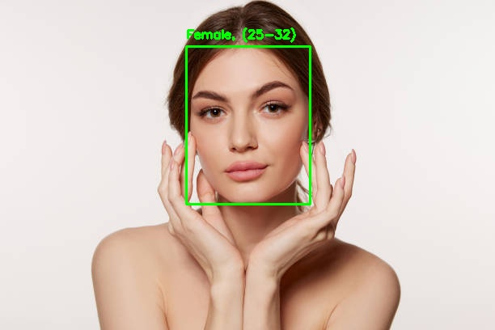

# Age and Gender API

This API is based on the work by [Mahesh Sawant](https://github.com/smahesh29) found
[here](https://github.com/smahesh29/Gender-and-Age-Detection).

It’s designed to be used with Request Directory and you can find more details
[here](https://request.directory/ageandgender)

## Development

### Install dependencies

```bash
pip install -r requirements.txt
```

### Run the API

```bash
python src/main.py
```

## Usage

By default, the API runs on port 7003.

```bash
docker run -it -p7003:7003 ghcr.io/arsenstorm/ageandgender:latest
```

## API

To use the API, you need to send a POST request containing form data to the
`/infer` endpoint with the following parameters:

#### Parameters

- `image`: The image to detect age and gender on.

#### Example Request

As an example, we’ll upload this image:


```bash
curl -X POST http://localhost:7003/infer -F "image=@.github/ageandgender/example_input.jpg"
```

#### Example Response

We get the following response:

```json
{
    "faces": [
        {
            "age": "(25-32)",
            "bounds": {
                "x1": 230,
                "x2": 383,
                "y1": 57,
                "y2": 252
            },
            "gender": "Female"
        }
    ],
    "image": "/9j/4AAQSkZJRgABAQAAAQABAAD/...", // shortened for brevity
    "success": true
}
```

The `faces` array contains the age and gender of each face detected in the image along with the bounds of the face.

The `image` field is a base64 encoded string, which can be decoded where
it’ll look like this:



## Notes

- Testing indicates that the API needs about 256MB of memory to run most
  optimally.
- When no API requests are running, the memory usage is roughly in the range of
  0.1-0.2GB.